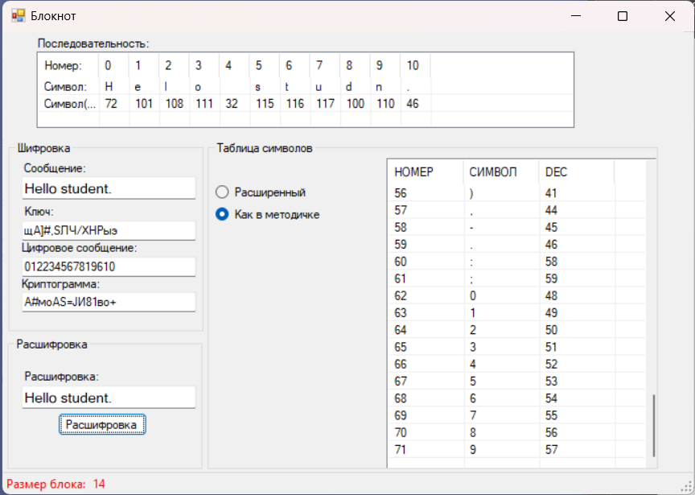
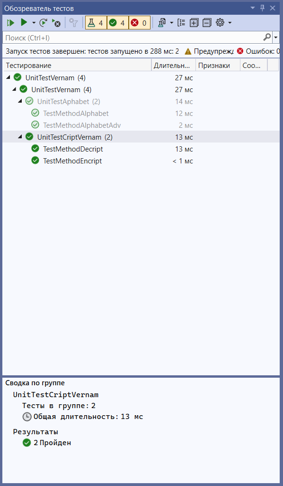

Encryption/decryption with an One-time pad(Одноразовый блокнот).  В решение два проекта:
- Оконное приложение на .NetFramework.
<figure class = "one">
	
	<figcaption>Рис 1. Общий вид приложения. Режим шифрования и дешифрования</figcaption>
</figure>

- Unit-тесты для них
<figure class = "one">
	
	<figcaption>Рис 2. тесты</figcaption>
</figure>
